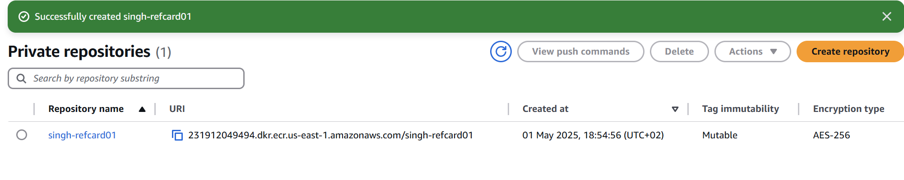
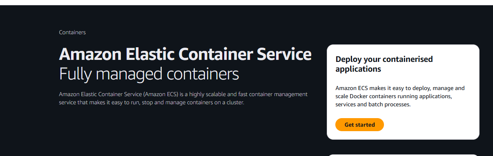

## Theoretischer Abschnitt

### Kurzzusammenfassung des Workflows
1. **Build**: Dockerfile → Image  
2. **Push**: Image → ECR  
3. **Referenzieren**: ECR-Image in Task Definition  
4. **Ausführen**: ECS Service startet Task aus der Task Definition  
5. **Zugreifen**: User stellt Anfrage über den Load Balancer  

---

## Praktischer Abschnitt

### Schritt 1: AWS ECR Repository erstellen
1. Gehen Sie auf die AWS ECR-Konsole:  
   [AWS ECR Konsole](https://us-east-1.console.aws.amazon.com/ecr/home?region=us-east-1)  
   

2. Erstellen Sie ein neues Repository:  
   

3. **Hinweis**: Es gab Probleme mit der Region. Der Wechsel zu einem US-Server hat das Problem gelöst.  
     
     

   **Repository erfolgreich erstellt. ✅**

---

### Schritt 2: Docker-Image hochladen
1. **Image erstellen und hochladen**:  
   Beim Hochladen des Images gab es Probleme mit der Anmeldung (Session Token).  
     

2. Nach der Behebung des Problems funktionierte der Upload:  
     
     

   **Image erfolgreich hochgeladen. ✅**  
   

---

### Dockerfile
Das folgende Dockerfile wurde für den Multi-Stage-Build verwendet:

### Schritt 3: ECS-Cluster erstellen

1. **Erstellen Sie einen ECS-Cluster:**

Cluster erstellt.

**Hinweis:**
Achten Sie darauf, den Cluster anders korrekt zu benennen, um Probleme mit der Repository-Verknüpfung zu vermeiden.
mehr probleme lol

3 **Cluster erfolgreich erstellt**:

Cluster erstellt

Task Definition erstellt. ✅

Cluster Service
Service vorbereiten um in der nächsten Aufgabe darauf zuzugreifen

VPC Security groups

Service testen

Service auf IP öffnen

Load-Balancer erstellen

Security groups

Neu erstellte SG für den Loadbalancer einsetzten

Listener and rules noch einbauen mit den TG

Jetzt sollten sie zu der Target Group weiter geleitet werden

 man sieht hier das es nur noch über den Loadbalancer geht

Aktualisierungsprozess für Versionen (ECS)
1. ECR-Repository und Docker Image:
Docker Image erneuern: Das bestehende Docker Image wird neu erstellt (Build-Prozess).
Image neu taggen: Das aktualisierte Image erhält einen neuen Tag (z.B. Versionsnummer oder :latest).
Push in ECR: Das getaggte Image wird in das ECR-Repository hochgeladen.
Zeitschätzung: Dieser Vorgang (Build und Push) dauert bei mir in der Regel nicht länger als eine Minute. Bei grösseren Images kann es bis zu maximal drei Minuten dauern.
2. Task Definition:
Task Definition erneut revisieren/aktualisieren: Die bestehende Task Definition wird überarbeitet, um auf das neue Image-Tag zu verweisen. Alternativ kann eine neue Revision der Task Definition erstellt werden.
Zeitschätzung: Das Überarbeiten oder Neuerstellen der Task Definition hat bei mir aufgrund anfänglicher Unklarheiten etwas Zeit in Anspruch genommen, insgesamt jedoch nicht mehr als drei Minuten.
3. Service:
Service aktualisieren: Der ECS-Service wird aktualisiert, um die neue Revision der Task Definition zu verwenden. Dies löst ein neues Deployment aus.
Zeitschätzung für Service-Aktualisierung:
Die Initialisierung eines Deployments dauert pro Service etwa zwei Minuten.
Bis die neuen Tasks vollständig gestartet und betriebsbereit sind ("running"), vergehen üblicherweise rund fünf Minuten.
Der Load Balancer benötigt zusätzliche Zeit für Health Checks der neuen Tasks und das ordnungsgemässe Herunterfahren der alten Tasks ("Draining"), was weitere drei bis fünf Minuten dauern kann.
4. Rolling Updates (Hinweise zum Prozess):
Während eines Rolling Updates laufen alte und neue Tasks für etwa zwei bis drei Minuten parallel.
In dieser Übergangsphase ist es entscheidend, dass beide Task-Generationen die definierten Mindestanforderungen an Zustand und Verfügbarkeit (definiert durch "Minimum Healthy Percent" in der Service-Konfiguration) erfüllen. Dies stellt die kontinuierliche Erreichbarkeit des Services sicher.

 Persönliches Fazit:

 Leider konnte ich die zweite Zusatzaufgabe nicht bearbeiten. Der Grund dafür war eine sehr ernste persönliche Krise, die meine ganze Energie und Aufmerksamkeit beansprucht hat. Dadurch war es mir nicht möglich, die zusätzliche Arbeit zu leisten. Es tut mir sehr leid, dass ich diese Umstände nicht früher mitgeteilt habe und die Aufgabe daher unbearbeitet geblieben ist.

Trotz dieser schwierigen Situation bin ich froh, dass ich die übrigen Kernaufgaben erfolgreich abschliessen konnte. Anfangs hatte ich einige Schwierigkeiten mit AWS, die ich aber überwinden konnte.

Ich hoffe, dass diese Dokumentation einen besseren Eindruck macht als meine vorherige. Auch wenn sie noch nicht perfekt ist – was unter anderem daran liegt, dass ich aufgrund der erwähnten Umstände verspätet mit der Bearbeitung beginnen konnte – bin ich diesmal deutlich zuversichtlicher und stolz darauf, sie einzureichen. Im Gegensatz zur letzten Dokumentation konnte ich diesmal alle wichtigen Schritte erfolgreich umsetzen und dokumentieren.